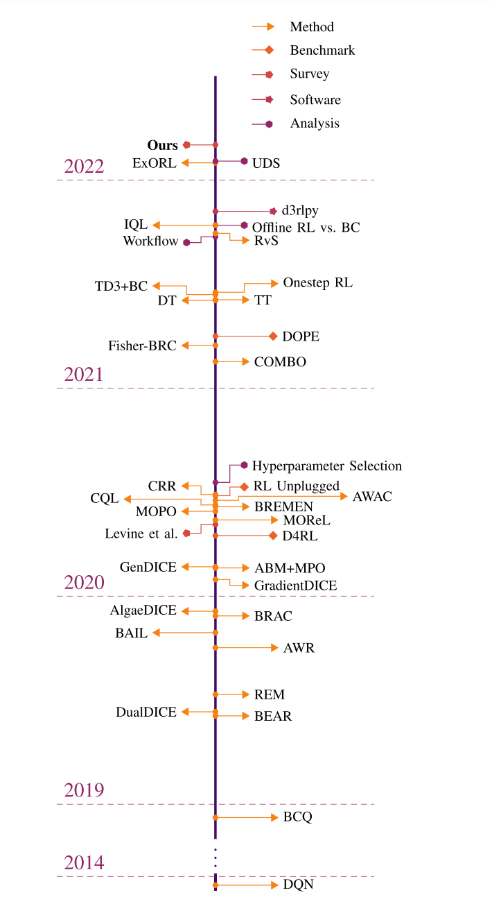

# move-as-experts
该项目旨在梳理模仿学习、离线强化学习、扩散模型与强化学习、以及Transformer与强化学习相关知识，方便进一步学习。

本项目计划分为三个阶段，分别是

- 知识梳理阶段 $\leftarrow$ **正在进行**
- 算法复现阶段
- 项目优化阶段

知识梳理阶段主要关注知识框架的搭建；算法复现阶段主要关注经典算法的代码复现；项目优化阶段主要关注**知识完整性和准确性**、**排版整洁性**、以及**代码准确性**。

欢迎批评指正～

欢迎一起做项目～

## 内容导航

### 模仿学习篇

| 章节                      | 进度一 | 进度二 | 进度三 |
| :------------------------ | :----: | ------ | ------ |
| 第一章 模仿学习简介       |  50%   |        |        |
| 第二章 行为克隆           |  70%   |        |        |
| 第三章 对抗模仿学习       |   1%   |        |        |
| 第四章 生成式对抗模仿学习 |  60%   |        |        |
| 第五章 one-shot模仿学习   |  90%   |        |        |
| 第六章 主动模仿学习       |        |        |        |
| 第七章 环境模仿           |        |        |        |
| 第八章 总结               |        |        |        |

### 离线强化学习篇

  

  图1 离线强化学习发展的时间线

| 章节                               | 进度一 | 进度二 | 进度三 |
| :--------------------------------- | :----: | ------ | ------ |
| 第一章 离线强化学习简介            |  10%   |        |        |
| 第二章 基于策略约束的方法与BCQ     |  90%   |        |        |
| 第三章 基于正则化的方法与CQL       |  90%   |        |        |
| 第四章 基于不确定性估计的方法与REM |  90%   |        |        |
| 第五章 BEAR算法                    |        |        |        |
| 第六章 BRAC算法                    |        |        |        |
| 第七章 Fisher-BRC算法              |        |        |        |
| 第八章 TD3-BQ算法                  |        |        |        |
| 第九章 总结                        |        |        |        |

### 特别篇

#### 扩散模型与强化学习篇

| 章节                                  | 进度一 | 进度二 | 进度三 |
| ------------------------------------- | ------ | ------ | ------ |
| 第一章 扩散模型基础                   | 80%    |        |        |
| 第二章 扩散模型在RL中扮演的角色       |        |        |        |
| 第三章 扩散模型在离线强化学习中的应用 |        |        |        |
| 第四章扩散模型在模仿学习中的应用      |        |        |        |
| 第五章 扩散模型在轨迹生成中的应用     |        |        |        |
| 第六章 扩散模型在数据增强中的应用     |        |        |        |
| 第七章 总结                           |        |        |        |

#### Transformer与强化学习

| 章节                                   | 进度一 | 进度二 | 进度三 |
| :------------------------------------- | :----: | ------ | ------ |
| 第一章 Decision Transformer            |        |        |        |
| 第二章 Multi-Game Decision Transformer |        |        |        |
| 第三章 Q-Transformer                   |   5%   |        |        |

## 关注我们

扫描下方二维码关注公众号：Datawhale

## LICENSE

 本作品采用<a rel="license" href="http://creativecommons.org/licenses/by-nc-sa/4.0/">知识共享署名-非商业性使用-相同方式共享 4.0 国际许可协议</a>进行许可。

*注：默认使用CC 4.0协议，也可根据自身项目情况选用其他协议*
