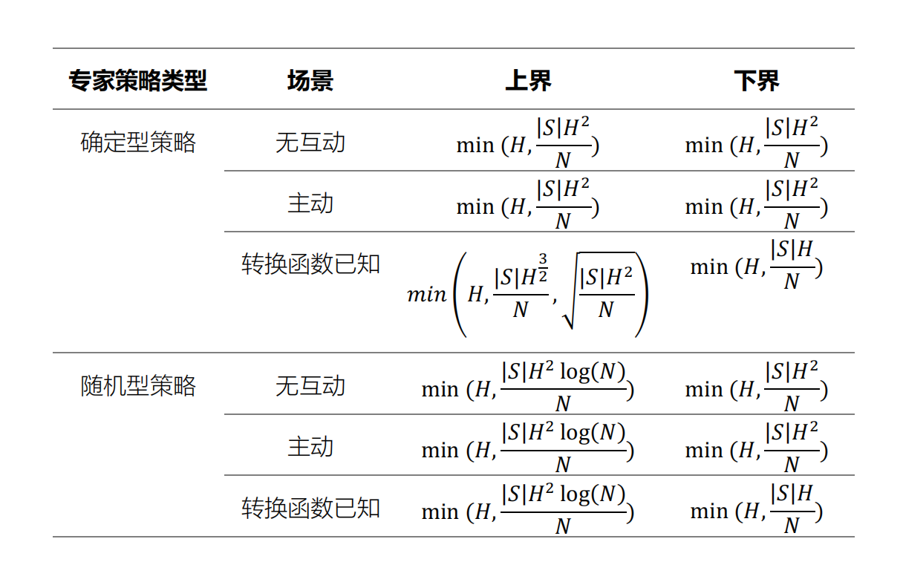

# 模仿学习简介

## 马尔可夫决策过程

### 有限长度回合制马尔科夫决策过程

### 无限长度折扣马尔可夫决策过程

## 统计极限

在模仿学习中，统计极限是研究专家策略与算法学习出策略在未观测样本上表现差异程度的上下界，从而知道模仿学习的难易程度。如式(1.2)所示，模仿学习误差的数学描述。
$$
\begin{equation}
error=J(\pi^{*})-E[J(\hat{\pi})]\tag{1.1}
\end{equation}
$$
对于有限长度回合制MDP下的模仿学习，文献[1]把模仿学习当成监督学习研究，分析专家策略的累积收益与模仿学习算法累积收益之间误差界。Ross等人表明若专家策略为确定型，模仿学习策略在每个状态猜错专家策略的概率为$\epsilon$，那么$J(\pi^{\*})-J(\hat{\pi})\le min\\{H,\epsilon H^2\\}$，对应的算法是行为克隆。

然而，文献[2]中指出基于监督学习表示的误差界是宽松的，可寻找到更紧的误差界。Rajaraman等人在**无交互场景**、**转换函数已知场景**、以及**主动学习场景**中研究有限长度回合制模仿学习的误差界。其中，无交互场景是指智能体在该场景中只是基于已有专家数据学习，没有与环境进行交互；转换函数已知场景是指环境的转换函数已知的情况下，智能体给予专家数据进行学习；主动学习场景是指智能体与环境交互，并询问专家获得反馈的方式进行学习。如表1所示，有限长度回合制MDP下不同场景误差的上下界。

  表1 有限长度回合制MDP下不同场景误差的上下界

## 复合误差(error compounding)

复合误差是指智能体犯错之后，无法回到正确状态或专家策略上。复合误差常常发生在智能体遇到未学习过的状态时，其在数学上的表达，可见文献[1]中误差上界的$H^2$项。虽然复合误差提出于行为克隆算法，但是这种误差是模仿学习中存在的基本问题，可以理解为没有算法能够打败$H^2$屏障。若从状态分布理解，专家的状态分布与智能体的状态分布之间的**协变量偏移问题**(covariate shift problem)导致复合误差产生，也即专家策略与智能体策略之间无法完全不一致。

## 参考文献

[1] Stéphane Ross, Bagnell D .Efficient Reductions for Imitation Learning[C]//International Conference on Artificial Intelligence and Statistics.JMLR Workshop and Conference Proceedings, 2010.DOI:doi:http://dx.doi.org/.

[2] Rajaraman N , Yang L F , Jiao J ,et al.Toward the Fundamental Limits of Imitation Learning[J].  2020.DOI:10.48550/arXiv.2009.05990.