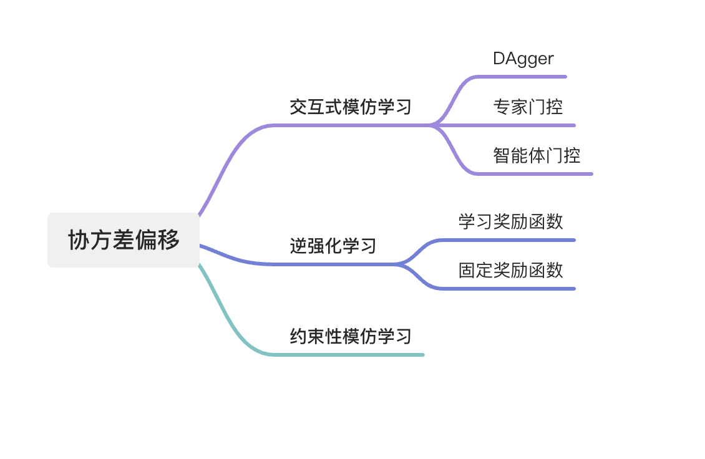

# 行为克隆

行为克隆把学习专家策略的问题当作监督学习任务，直接学习从环境状态到专家动作的映射。该学习范式的优势是：它不需要环境状态转换的知识，仅根据被提供的专家演示数据学习专家策略。同时，这种监督学习范式是很高效的。因此，最直接的建模方式是极大似然估计。如式(2.1)所示，行为克隆的数学表达式。
$$
\begin{equation} 
\mathbb{P}(tr)=\rho(s_1)\prod_{h=1}^HP_h(s_{h+1}\vert s_h,a_h)\pi_h(a_h\vert s_h)\tag{2.1}
\end{equation}
$$
式(2.1)经过化简，可得式(2.2)。
$$
\begin{equation}
log(\mathbb{P}(tr))=\sum_{h=1}^Hlog\pi_h(a_h\vert s_h)+constant\tag{2.2}
\end{equation}
$$
其中，式(2)中constant指与策略$\pi$无关的项，只与初始状态分布、转移函数有关。

 那么，对于数据集$\mathcal{D}$中$N$条专家轨迹，则有目标函数式(2.3)
$$
\max_\pi\sum_{h=1}^{H}\sum_{s_h,a_h\in \mathcal{D}}log\pi_h(a_h\vert s_h) \\\\
\operatorname{ s.t. } 
\sum_a\pi_h(a|s)=1,\forall s\in S,h\in[H].\tag{2.3}
$$
在表格模型中，目标函数(2.3)的最优解如式(2.4) 
$$
\begin{equation}
\pi^{BC}\_h(a\vert s)=\begin{cases}
\frac{\\#tr\_h(.,.)=(s,a)}{\sum\_{{a}'}\\#tr\_h(.,.)=(s,{a}')} & if \sum\_{{a}'}\\#tr\_h(.,.)=(s,{a}')>0 \\\\
\frac{1}{\vert\mathcal{A}\vert} & otherwise
\end{cases}\tag{2.4}
\end{equation}
$$
根据式(2.4)，可知，若状态$s$存在于轨迹的第$h$时刻中，那么策略为所有轨迹$h$时刻状态-动作$(s,a)$出现个数与状态$s$出现个数的比值；若状态$s$不存在于任何轨迹的$h$时刻，那么时刻$h$该状态下所有动作的概率为$\frac{1}{\vert\mathcal{A}\vert}$，$\vert\mathcal{A}\vert$表示所有动作个数，即是均匀策略。对于专家数据集来说，若状态$s$不出现或极少出现，代表着专家知道在该类状态$s$并不会导致累积收益最大化，反而对收益产生影响。因此，行为克隆算法对于专家数据集中不包含的状态$s$采取均匀策略，导致策略$\pi$在未访问状态$s$上存在模仿间隔(imitation gap)，也被称为**协变量偏移**。有的文献也把协变量偏移问题称为**复合误差**。

协变量偏移问题是行为克隆一个很重要的劣势。更准确的说，该问题产生的原因是：在模型训练期间，学习器根据专家策略产生的状态学习；然而，在自己策略产生的状态进行测试。因此，测试期间观测到的状态分布与训练期间观测的状态分布不一致导致协变量偏移问题发生。同时，解决协变量偏移问题在安全性要求很高的领域是重要的，例如：若自动驾驶汽车遇到训练时未访问过的状态，那么从错误中恢复的能力对于避免事故很重要。

## 协变量偏移问题的处理

为了提供行为克隆算法的鲁棒性和处理协变量偏移问题，三个广泛研究的领域被提出(如图2.1所示)。

  

  图2.1 协变量偏移问题处理方法的分类

接下来，主要介绍一下交互式模仿学习和约束性模仿学习，而逆强化学习会在第三章详细介绍。

### 交互式模仿学习

交互式模仿学习在一些文献中也被称为主动学习。该类学习方法的前提假设是智能体能够询问专家意见，即在模型训练时，智能体能够咨询专家。DAgger[2] (Dataset aggergation)算法是最早提出的交互式模仿学习算法，其解决训练和测试分布不一致问题的方法是：首先，智能体与环境交互产生数据；然后，询问专家对数据重新打标签，选择合适的动作；最后，利用重新标记后的数据训练智能体。然而，这种方式会给专家带来严重的认知负担，从而产生不精确或延时反馈影响训练过程。因此，后来又提出了基于门控机制的DAgger，即不需要专家对每条数据进行反馈。

根据门控机制的不同可以分为专家门控DAgger[3],[4] (Human-gated DAgger, 也称HG-DAgger)和智能体门控Dagger(Robot-gated DAgger)。其中，HG-DAgger[2]是专家决定什么时候提供纠正干预。例如：若智能体学习过程中到达了一个不安全区域，那么专家决定干预控制系统，引导智能体回到安全领域。

然而，基于专家门控的方式需要专家持续的监视智能体以决定什么时候干预，也产生了很重的认知负担。这个时候，基于智能体门控的算法产生了，这类算法允许智能体主动要求人类干预，例如：SafeDagger[5]用一个辅助安全策略确定智能体偏移专家轨迹的概率，作为智能体把控制权交给专家的信号；LazyDAgger[6]是SafeDagger的扩展，其减少了控制权转换的次数。最近的一个工作ThriftyDAgger[7]核心思想是只有状态足够新或风险高时，才会让专家干预。

### 约束性模仿学习

约束性模仿学习算法限制智能体在专家策略下状态分布的空间，不依赖于专家交互，也不利用RL。这种方法对于安全性必须满足的领域特别实用和有益，例如：医疗、自动驾驶、以及工业生产制造。文献[9]中，作者通过增加可减少坏驾驶行为的额外损失来限制智能体的策略。此外，还提供了专家轨迹扰动后的数据集。这份数据使智能体暴露在非专家行为中，提供了避免坏驾驶行为的信号。文献[10]中，作者提出了一个学习错误探测的系统，以表明智能体是否处于潜在的危险状态。从而限制智能体执行访问过的状态，阻止执行潜在不稳定的行为。

## 挑战

## 参考文献

[1]Zare M, Kebria P M, Khosravi A, et al. A survey of imitation learning: Algorithms, recent developments, and challenges[J]. arXiv preprint arXiv:2309.02473, 2023.

[2] Ross S, Gordon G, Bagnell D. A reduction of imitation learning and structured prediction to no-regret online learning[C]//Proceedings of the fourteenth international conference on artificial intelligence and statistics. JMLR Workshop and Conference Proceedings, 2011: 627-635.

[3] Kelly M, Sidrane C, Driggs-Campbell K, et al. Hg-dagger: Interactive imitation learning with human experts[C]//2019 International Conference on Robotics and Automation (ICRA). IEEE, 2019: 8077-8083.

[4] Mandlekar A, Xu D, Martín-Martín R, et al. Human-in-the-loop imitation learning using remote teleoperation[J]. arXiv preprint arXiv:2012.06733, 2020.

[5] Zhang J, Cho K. Query-efficient imitation learning for end-to-end simulated driving[C]//Proceedings of the AAAI conference on artificial intelligence. 2017, 31(1).

[6] Hoque R, Balakrishna A, Putterman C, et al. Lazydagger: Reducing context switching in interactive imitation learning[C]//2021 IEEE 17th International Conference on Automation Science and Engineering (CASE). IEEE, 2021: 502-509.

[7] Hoque R, Balakrishna A, Novoseller E, et al. ThriftyDAgger: Budget-aware novelty and risk gating for interactive imitation learning[J]. arXiv preprint arXiv:2109.08273, 2021.

[8] Menda K, Driggs-Campbell K, Kochenderfer M J. Ensembledagger: A bayesian approach to safe imitation learning[C]//2019 IEEE/RSJ International Conference on Intelligent Robots and Systems (IROS). IEEE, 2019: 5041-5048.

[9] Bansal M, Krizhevsky A, Ogale A. Chauffeurnet: Learning to drive by imitating the best and synthesizing the worst[J]. arXiv preprint arXiv:1812.03079, 2018.

[10] Wong J, Tung A, Kurenkov A, et al. Error-aware imitation learning from teleoperation data for mobile manipulation[C]//Conference on Robot Learning. PMLR, 2022: 1367-1378.