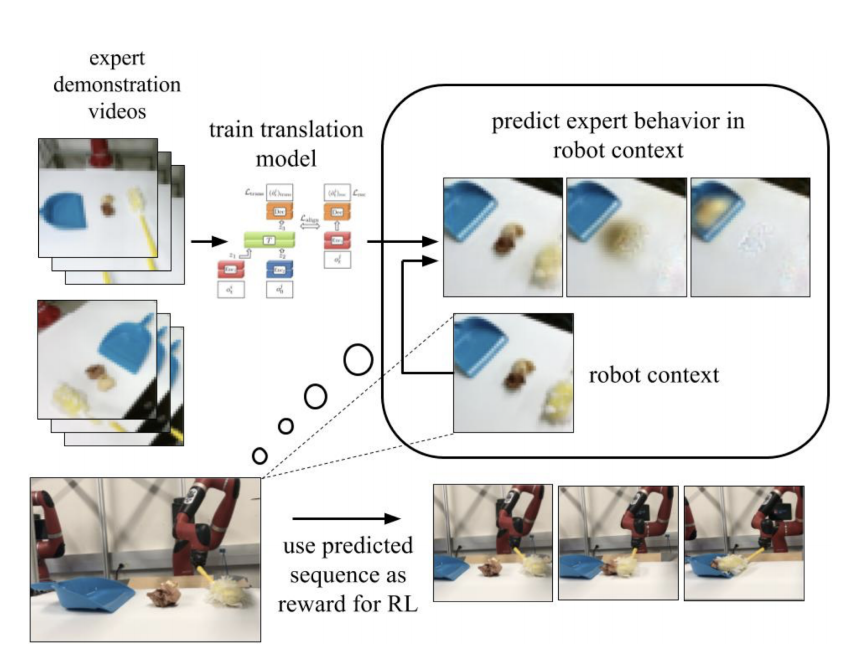
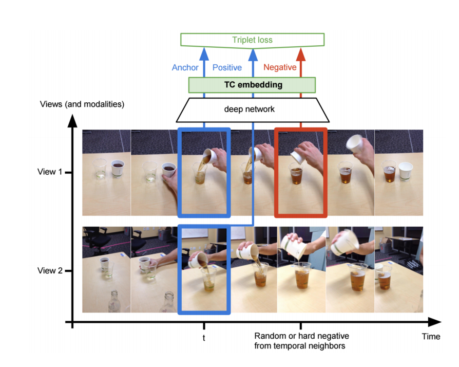

# Imiation from Observation

从观测中模仿是一类直接根据观测数据模仿学习的算法。与之前的学习范式相比，这种学习范式更加自然，与人类学习类似，只需要观测他人的动作然后模仿就行了，不需要知道低级的动作，例如：肌肉的命令。人类观看视频，学习了大量的技术，例如：游泳、打游戏。这种学习范式的再次兴起，得益于深度学习不需要精细的特征工程，只需要直接输入图片数据进行学习。

## 算法发展历程

文献[2]中提出了一种学习算法，该算法训练了一个上下文翻译模型，把专家上下文的演示翻译成智能体上下文的演示。然后，利用翻译模型在智能体上下文中预测专家动作。同时，利用预测观测定义了一个奖励函数，该奖励函数由两项惩罚构成，分别是专家观测特征与预测观测之间差异、翻译的观测与预测观测之间的差异。如图5.1所示，利用专家演示训练的上下文翻译模型。

  

  图5.1 利用专家演示训练的上下文翻译模型

最后，利用强化学习技术优化模仿学习策略的奖励函数。然而，现实世界中不同上下文的演示在时间几乎很难对齐。同时，翻译模型的训练也需要大量的数据，而且也不能进行系统领域的迁移，例如：不同实体之间的学习。

文献[3]利用TCN(time-contrastive networks)引入了一个自监督表示学习。TCN训练了一个从视频帧中抽取不同上下文中不变特征的神经网络，例如：相机角度。通过利用一个三体损失函数，使不同模态同时发生的帧在向量空间中相近，相似帧发生时间差较大的帧在向量空间中距离较远，可见图5.2。

  

  图5.2 TCN网络示意图

为了构建奖励函数，利用欧式距离度量智能体相机图片embedding与演示embedding之间距离。最后，利用强化学习技术优化模仿学习策略的奖励函数。然而，这种技术需要多视角的训练视频，在现实中往往不存在。

BCO(Behavior Cloning from Observation)[4]算法首先通过智能体利用随机策略与环境交互而收集的数据，学习了一个逆动力学模型。然后，该模型用于推断专家演示数据中的动作。最后，利用BC算法建模状态与动作之间的映射，得到专家策略。该算法的目的是最小化BC算法训练的智能体与环境的交互次数。

文献[5]把GAIL算法应用到IfO(Imitation from Obeservation)中，形成了GAIfO算法。该方法能够克服BCO算法的协变量偏移问题，且能够处理时间不对齐的演示。在专家与智能体处于同样的环境和同样动力学下，性能优越。

文献[6]引入了一个非对抗的逆强化学习算法。在该方法中，条件状态转换概率用于匹配专家与智能体。根据作者的发现，相较于GAIfO，该匹配条件状态转换概率很少关注专家与智能体之间不相关的不同。特别的，该方法很少产生错误惩罚的现象。

文献[7]提出了一种源领域状态与目标领域状态映射的框架。这种方法能够处理实体、视角、以及动力学不匹配的问题。为了在领域迁移的过程中保存MDP动力学知识，局部的和全局的对齐被执行。在局部对齐中，对抗训练用于最小化真实状态转换分布与迁移轨迹之间的距离。同时，时序位置函数被用于全局对齐，确保两个领域的状态被放置在同一时间位置上。最终，基于迁移的演示，BCO算法用于学习最终的策略。

## 参考文献

[1] Zare M, Kebria P M, Khosravi A, et al. A survey of imitation learning: Algorithms, recent developments, and challenges[J]. arXiv preprint arXiv:2309.02473, 2023.

[2] Liu Y X, Gupta A, Abbeel P, et al. Imitation from observation: Learning to imitate behaviors from raw video via context translation[C]//2018 IEEE International Conference on Robotics and Automation (ICRA). IEEE, 2018: 1118-1125.

[3] Sermanet P, Lynch C, Chebotar Y, et al. Time-contrastive networks: Self-supervised learning from video[C]//2018 IEEE international conference on robotics and automation (ICRA). IEEE, 2018: 1134-1141.

[4] Torabi F, Warnell G, Stone P. Behavioral cloning from observation[J]. arXiv preprint arXiv:1805.01954, 2018.

[5] Torabi F, Warnell G, Stone P. Generative adversarial imitation from observation[J]. arXiv preprint arXiv:1807.06158, 2018.

[6] Jaegle A, Sulsky Y, Ahuja A, et al. Imitation by predicting observations[C]//International Conference on Machine Learning. PMLR, 2021: 4665-4676.

[7] Raychaudhuri D S, Paul S, Vanbaar J, et al. Cross-domain imitation from observations[C]//International Conference on Machine Learning. PMLR, 2021: 8902-8912.

