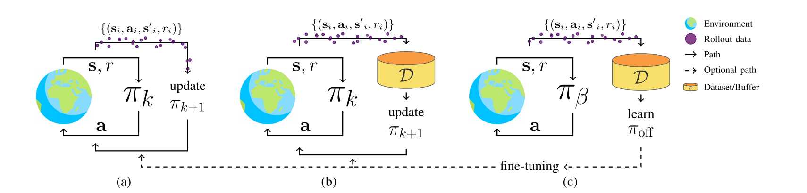

# 离线强化学习简介

AlphaGo的诞生，见证了强化学习的威力。然而，在工业界，强化学习落地极其困难。这是因为其需要与环境交互试错的方式学习，大部分真实场景并不像游戏领域那样，与环境交互几乎无成本，例如：若机器人与环境交互过程中摔倒了，可能造成传感器的损坏，就会产生高额的成本。在强化学习中，智能体往往需要与环境大量的交互与试错，这种成本是很高的。

与强化学习不同的是，离线强化学习利用离线静态数据学习，其不需要与环境交互，可见图1.1所示。若利用离线强化学习对智能体策略模型初始化，再用强化学习的方式进行微调，那么就会让强化学习解决更多具有挑战性的问题。

图1.1 不同的强化学习范式

图1.1中(a)为强化学习范式，也可以称为在线强化学习范式；(b)为off-policy强化学习范式；(c)为离线强化学习范式。

## 特性

离线强化学习利用静态数据集学习，它并没有在线强化学习那样的最优性保证。与监督学习相比，该算法利用的数据存在很多噪音。然而，离线强化学习仍有很重要的研究意义。该学习范式有以下特性：

1. 泛化性：与在线强化学习相比，离线强化学习可利用更广泛和多样的数据集，其泛化性更好。
2. 过滤：区分数据集中好行为和坏行为，对学习出更好的策略有很大的帮助。
3. 组合性：合并轨迹中好的行为，有利于学习出更优策略。

离线强化学习一个很明显的挑战就是分布偏移，这是因为模型训练过程中很容易遇到数据集中不存在的情况，而没有该情况的任何信息，即分布偏移的部分好与坏不可知。

## 模型评估方法

## 参考文献

[1] Prudencio R F, Maximo M R O A, Colombini E L. A survey on offline reinforcement learning: Taxonomy, review, and open problems[J]. IEEE Transactions on Neural Networks and Learning Systems, 2023.
