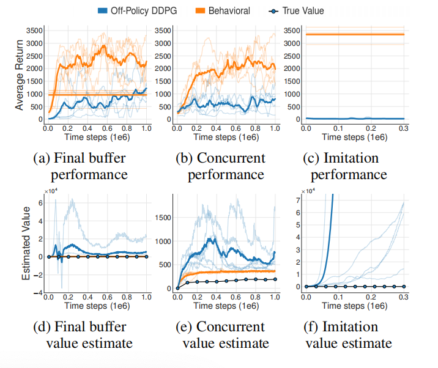

# 基于策略约束的方法与BCQ

策略约束的离线强化学习算法可被分为两类，分别是显式策略约束和隐式策略约束。显式策略约束方法直接约束策略$\pi$与行为策略$\pi_{\beta}$的距离，即限制策略的分布偏移程度，可见式(2.1)。
$$
J(\theta)=\mathbb{E}\_{s\sim d^{\pi\_{\theta}}(.),a\sim\pi\_{\theta}(.\vert s)}[Q^{\pi}(s,a)] \\
s.t.\quad D(\pi\_{\theta(.\vert s)},\hat{\pi}\_{\beta}(.\vert s))\le\epsilon\tag{2.1}
$$
式(2.1)中$D(\pi\_{\theta}(.\vert s),\hat{\pi}\_{\beta}(.\vert s))$为度量两个策略概率分布之间的距离，常见的度量是$f-divergence$。行为策略$\hat{\pi}\_{\beta}(.\vert s)$的估计方法可为行为克隆或非参数估计法。

显式策略约束方法需要估计行为策略$\pi\_{\beta}$，若其估计不准确，那么该方法的性能会大大下降。隐式策略约束方法对策略进行约束的同时，也避免了估计行为策略约束的需要。该方法把带约束的优化问题式(2.1)，转化为Lagrangian函数为式(2.2)。
$$
\begin{equation}
\mathcal{L}(\pi,\lambda)=\mathbb{E}\_{s\sim d^{\pi\_{\beta}}(.)}[\mathbb{E}\_{a\sim\pi(.\vert s)}[\hat{A}^{\pi}(s,a)]+\lambda(\epsilon-D\_{KL}(\pi(.\vert s)\Vert\pi\_{\beta}(.\vert s)))]\tag{2.2}
\end{equation}
$$
利用KKT条件，求解式(2.2)。根据$\frac{\partial\mathcal{L}}{\partial\pi}=0$，可得$\pi^{*}(a\vert s)\propto\pi\_{\beta}(a\vert s)exp(\lambda^{-1}\hat{A}^{\pi\_k}(s,a))$

由于策略$\pi_{\theta}$的估计是参数化函数近似器的方式，那么需要把非参数解$\pi^\*$投射到策略空间，也可以直接最小化$\pi\_{\theta}$与$\pi^\*$之间KL-Divergence的方式进行参数$\theta$估计。那么，策略提升的目标函数为式(2.3)
$$
\begin{equation}
J(\theta)=\mathbb{E}\_{s,a\sim\mathcal{D}}[log\pi\_{\theta}(a\vert s)exp(\frac{1}{\lambda}\hat{A}^{\pi}(s,a))]\tag{2.3}
\end{equation}
$$

## Batch-Constrained deep Q-learning

BCQ算法是离线强化学习的开篇之作。在文献[2]中，作者首先分析了推断错误产生的三个原因，分别是数据不足、模型偏差、训练中的不匹配。其中，数据不足是指若数据$({s}',\pi({s}'))$不足，那么$Q_{\theta}({s}',\pi({s}'))$估计也不准确；模型偏差是指贝尔曼运算$\mathcal{\tau}^{\pi}$的动态转换估计的偏差，其转换形式可见式(2.4)
$$
\begin{equation}
\tau^{\pi}Q(s,a)\approx\mathbb{E}_{{s}'\sim\mathcal{B}}[r+\gamma Q({s}',\pi({s}'))]\tag{2.4}
\end{equation}
$$
式(2.4)中期望是关于数据集$\mathcal{B}$中转换函数的期望。

训练中的不匹配是指即使数据足够，那么若数据集$\mathcal{B}$中的数据分布与策略$\pi$对应的数据分布不一致，价值函数的估计也是不足的。

接下来，作者利用gym中Hopper-v1环境和DDPG算法做了三个实验。第一个实验**Final Buffer**是DDPG智能体以一定探索型噪音的方式在Hopper-v1环境中交互训练100万个时间步，存储所有的转换经验，从而创建一个包含各种各样状态-动作的数据集。接下来再利用刚收集的数据离线训练另一个DDPG智能体。第二个实验**Concurrent**是两个智能体同时学习。行为策略与环境交互产生数据，存储在replay-buffer。行为策略的动作增加了以高斯分布$\mathcal{N}(0,1)$的噪音，从而保证足够的探索。然后，行为克隆智能体与off-polciy智能体同时基于这份数据学习。第三个实验**Imitation**是一个训练好的DDPG智能体作为专家与环境交互100万步，收集这部分数据，行为克隆智能体与off-polciy智能体基于这份数据学习。

  

  图2.1 三种实验结果

**注解：** 每个单独的实验结果都是用细线画出。粗线表示的是均值(无探索噪音下评估的结果)。直线代表的是episodes的平均回报(有探索噪音)。点划线是基于Monte-Carlo估计的off-policy智能体的真实值。在所有三个实验中都观察到行为克隆与off-policy智能体之间在表现上存在大的间隔。此外，off-policy智能体的值估计是不稳定的或发散的，且是高估的。

实验结果表明离线强化学习的策略明显比行为克隆算法的策略效果差。根据并发学习环境下的结果，可知，若初始策略下状态分布存在差异，那么也足够导致离线强化学习的推断错误。对于在线强化学习来说，高估有利于探索，智能体探索之后就会纠正估计。然而，对于离线强化学习来说，高估会导致盲目的乐观且得不到纠正，最终造成策略表现很差。

### BCQ算法

BCQ算法背后的思想是：为了避免推断错误，策略$\pi$下的状态-动作访问分布应该与该batch数据集中状态-动作访问分布相似。满足该思想的策略被称为batch-constrained。为了得到batch-constrained策略，策略训练的目标应该是：

1. 最小化策略$\pi$与行为策略$\pi_{\beta}$之间的距离。
2. 策略$\pi$下的状态分布与数据集中状态分布应相似。
3. 最大化价值函数。

在以上三个目标中，目标(1)的重要性高于其它两个目标。这是因为若目标(1)不能被满足，那么目标(2)和(3)也不能被满足。

文献[2]分析了batch-constrained策略在有限回合制马尔科决策过程中的理论特性，结论如下：

1. 若策略$\pi$下数据分布完全包含于行为策略$\pi_{\beta}$下数据分布，那么batch-constrained策略能够消除推断错误。
2. 与标准Q-learning相同条件下，Q-learning的batch-constrained变体能够拟合到最优策略。
3. 在确定型MDP下，BCQ被保证匹配或超越行为策略$\pi_{\beta}$。

如图2.2所示，BCQ算法的伪代码。

  

  图2.2 BCQ算法的伪代码

为了满足目标(1)，把数据集$\mathcal{B}$中状态-动作分布建模为$P^G_{\mathcal{B}}(a\vert s)$。由于高纬空间中$P^G_{\mathcal{B}}(a\vert s)$难以估计，所以训练VAE生成模型$G_w(s)$，用于生成动作。图2中，式(13)为

$$
\begin{aligned}
r+\gamma\underset{a_i}{max}[\lambda\underset{j=1,2}{min}Q_{{\theta}'_j}({s}',a_i)+(1-\lambda)\underset{j=1,2}{max}Q_{{\theta}'_j}({s}',a_i)]
\end{aligned}\tag{5}
$$

确切来说，BCQ算法通过VAE生成模型实现batch-constrained概念。对于给定的状态，BCQ产生一系列与batch中高度相似的动作，然后通过Q网络选择价值最高的动作。此外，还基于文献[3]中Clipped Double Q-learning算法的改进版，对未见过的状态进行惩罚。惩罚方式可见式(5)，价值估计选择两个Q网络的$\{Q_{\theta_1},Q_{\theta_2}\}$的最小值。文献[3]中这种方式被用于降低价值高估的问题，而BCQ算法中用于惩罚对不确定区域的估计方差过大的问题。因此，式(5)中最小化的权重大于最大化的权重。

对于生成模型$G_{w}$，被用于采样$n$个动作。同时，为了增加随机性或多样性引入了扰动模型$\xi_{\phi}(s,a,\Phi)$，其输出范围为$[-\Phi,\Phi]$。其中，扰动模型的目标函数为

$$
\begin{aligned}
\phi\leftarrow\underset{\phi}{argmax}\sum_{(s,a)\in\mathcal{B}}Q_{\theta}(s,a+\xi_{\phi}(s,a,\Phi))
\end{aligned}\tag{6}
$$

## 参考文献

[1] Prudencio R F, Maximo M R O A, Colombini E L. A survey on offline reinforcement learning: Taxonomy, review, and open problems[J]. IEEE Transactions on Neural Networks and Learning Systems, 2023.

[2] Fujimoto S, Meger D, Precup D. Off-policy deep reinforcement learning without exploration[C]//International conference on machine learning. PMLR, 2019: 2052-2062.

[3] Fujimoto S, Hoof H, Meger D. Addressing function approximation error in actor-critic methods[C]//International conference on machine learning. 