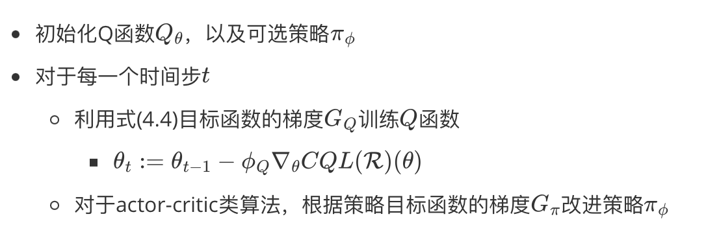

# 基于正则化的方法

正则化是一个很好调节模型的工具。对于策略的正则化，策略梯度的目标函数可为式(4.1)。
$$
\begin{equation}
J(\theta)=\mathbb{E}\_{s,a\sim\mathcal{D}}[\mathcal{Q}^{\pi\_{\theta}}(s,a)]+\mathcal{R}(\theta)\tag{4.1}
\end{equation}
$$
对于值函数的正则化，目标函数可为式(4.2)。
$$
\begin{equation}
J(\phi)=\mathbb{E}\_{s,a,{s}'\sim\mathcal{D}}[(r(s,a)+\gamma\mathbb{E}\_{{a}'\sim\pi\_{off}(.\vert s)}[\mathcal{Q}\_{\phi}^{\pi}({s}',{a}')]-\mathcal{Q}^{\pi}\_{\phi}(s,a))^2]+\mathcal{R}(\phi)\tag{4.2}
\end{equation}
$$
式(3.1)和(3.2)中$\mathcal{R}(\theta)$表示的是正则化项。

正则化可以调节模型的形状或参数，但是不能限制策略$\pi_{\theta}$与$\pi_{\beta}$的距离。因此，基于正则化的离线强化学习算法，需要其它方法限制策略，例如：保守型模型、策略约束。

## Conservative Q-Learning

为了解决由智能体学到的策略$\pi$与数据产生的行为策略$\pi_{\beta}$之间分布偏移产生的价值高估问题，CQL算法学习出保守型Q函数，使Q函数的期望值为策略$\pi$下价值函数$V(s)$真实值的下界。在理论上，证明了CQL的确产生了价值函数$V(s)$真实值的下界，且该算法可应用到策略学习迭代步骤中。

为了公式的简洁性，利用$\mathcal{B}^*Q(s,a)$表示贝尔曼最优运算，可见式(4.3)
$$
\mathcal{B}^*Q(s,a)=r(s,a)+\gamma\mathbb{E}\_{{s}'\sim P({s}'|s,a)}[max\_{{a}'}Q({s}',{a}')]\tag{4.3}
$$
利用$\mathcal{B}^{\pi}Q$表示策略$\pi$下的贝尔曼运算，可见式(4.4)
$$
\mathcal{B}^{\pi}Q=r + \gamma \mathbb{E}\_{{s}'\sim T({s}'\vert s,a),{a}'\sim\pi({a}'\vert{s}')}Q({s}',{a}')\tag{4.4}
$$

### Conservative Off-Policy Evaluation

CQL主要考虑的是防止策略$\pi$下价值函数$V^{\pi}(s,a)$的高估问题。因此，在最小化贝尔曼误差的同时，也最小化$Q(s,a)$的值，可见式(4.5)。
$$
\begin{equation}
\hat{Q}^{k+1}\leftarrow \underset{Q}{argmin}\quad\alpha\mathbb{E}\_{s\sim\mathcal{D},a\sim{\mu(s,a)}}[Q(s,a)]+\frac{1}{2}\mathbb{E}\_{s,a\sim\mathcal{D}}[(Q(s,a)-\hat{\mathcal{B}}^{\pi}\hat{Q}^k(s,a))^2]\tag{4.5}
\end{equation}
$$
由于标准的$Q(s,a)$函数的训练，不会查询未观测过的状态，但会查询未观测过的动作。所以，限制$\mu$与数据集中状态边缘分布匹配，以便于$\mu(s,a)=d^{\pi\_{\beta}}(s)\mu(a\vert s)$成立。其中，$d^{\pi\_{\beta}}(s)$为策略$\pi_{\beta}$下的状态$s$的折扣边缘分布。

### Conservative Q-Learning

  

  图4.1 CQL算法伪代码

## 参考文献

[1] Kumar A, Zhou A, Tucker G, et al. Conservative q-learning for offline reinforcement learning[J]. Advances in Neural Information Processing Systems, 2020, 33: 1179-1191.

[2] Prudencio R F, Maximo M R O A, Colombini E L. A survey on offline reinforcement learning: Taxonomy, review, and open problems[J]. IEEE Transactions on Neural Networks and Learning Systems, 2023.
