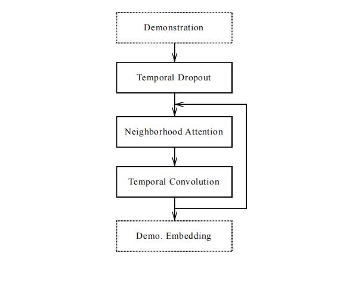

# one-shot模仿学习

对于机器人学习新任务，更多的是希望它能够根据少量的演示就能完成任务。然而，模仿学习往往需要大量的数据和精细的特征工程。文献[1]中结合元学习与模仿学习形成了one-shot模仿学习，该算法把同一任务的一种演示和另一种不同初始状态演示的状态作为输入，预测该状态下动作的方式训练神经网络，从而使模型只需根据新任务的一段演示就能完成任务的通用能力。

## 问题设定

*one-shot模仿学习问题由$\langle \mathbb{T},\mathbb{D},\pi,\mathcal{R} \rangle$构成，其中*

- *$\mathbb{T}$是任何的分布，单个任务由$t$表示。*
- *$\mathbb{D}$是演示的分布，$\mathbb{D}(t)$指的是任务$t$演示的分布。*
- *$d\sim\mathbb{D}(t)$是一个演示的观测和动作序列。*
- *$\pi_{\theta}(a\vert o,d)$表示的是策略。*
- *$\mathcal{R}_t(d)$是任务标量值的评估函数。*

*该学习问题的目标是对于任务$t\in\mathbb{T}$和演示$d\in\mathbb{D}(t)$最大化策略的期望表现。*

虽然one-shot模仿学习的设定希望模型拥有跨任务的通用能力，但论文中Particle Reaching和Block Stacking两个任务族的网络结构是不同的。总的来说，由于演示序列的存在，该网络是一个序列网络结构。

## 架构

### Particle Reaching任务的网络架构

- **Plain LSTM**：隐藏层为512单元的LSTM编码演示轨迹，其输出与当前状态concat到一起，再输入全连接神经网络，最终输出动作。
- **LSTM with attention**：LSTM模块根据演示序列输出不同路标的权重向量。然后，根据当前状态得到路标位置的权重组合。最后，concat智能体位置与路标位置权重组合，输入到全连接神经网络生成动作。
- **Final state with attention**：与上面两个不同的是该网络架构只利用演示的最后状态作为输入，得到路标的权重向量。接下来的步骤，与以上两个网络一致。

以上三个网络越来越适用于特定场景，表明了表达力和泛化性之间存在权衡。

### Block Stacking任务的网络架构

对于block stacking任务，策略网络应该具有以下特性：

1. 应该很容易应对任务中变化的block数量。
2. 对于同一任务的不同序列，很容易泛化。
3. 应该能够容纳可变长度的演示。

#### 周围的注意力

周围注意力机制的输入是每个block的embedding，用$h_i^{in}$表示，可以是由每个block位置投射运算形成的，也可以是之前周围注意力的输出。每个block向量$h_i^{in}$经过线性运算，得到查询向量$q_i$和上下文向量$c_i$，可见式(5.1)。
$$
\begin{equation}
q_i\leftarrow Linear(h_i^{in})\qquad c_i\leftarrow Linear(h_i^{in})\tag{5.1}
\end{equation}
$$
若每个block的位置用$(x_i,y_i,z_i)$表示，那么周围注意力的计算方法为
$$
\begin{equation}
result_i\leftarrow SoftAttention(\\\\
\qquad query: q_i,\\\\
\quad context: \{c_j\}_{j=1}^B \\\\
\qquad memory:\{concat((x_i,y_i,z_i),h_j^{in})\}_{j=1}^B
)\tag{5.2}
\end{equation}
$$
每个查询向量$q_i$先计算与所有block的上下文向量$c_j$之间的权重信息，计算方式可见式(5.3)。
$$
\begin{equation}
w_i\leftarrow v^T tanh(q+c_i)\tag{5.3}
\end{equation}
$$
然后，再利用归一化后的权重信息，得到输出结果。
$$
\begin{equation}
output\leftarrow \sum_im_i\frac{exp(w_i)}{\sum_jexp(w_j)}\tag{5.4}
\end{equation}
$$

#### 演示网络

    图5.1 演示网络架构

其中， Temporal Dropout是时序丢弃，即演示序列中的一个frame按照概率选择是否丢弃，从而降低过长序列带来的时间和内存的消耗。在测试阶段，下采样多条轨迹，且利用多条轨迹的平均计算结果做为embedding。

#### 上下文网络

    图5.2 上下文网络架构

上下文网络首先根据当前状态计算演示embedding的查询向量，被用于关注演示embedding中不同时间步的信息。对同一时间不同block的注意力权重求和，形成一个权重向量。接下来，时序注意力输出与block数量成比例的embedding，再通过周围注意力传播每个block的embedding信息。这个过程会被持续多次，且利用带有untied weights的LSTM单元推进状态。最终，得到一个大小与演示序列长度无关但与block数量相关的embedding。

接下来，再利用软注意力获取block的位置信息，产生一个固定大小的embedding。最后，位置信息向量与状态向量输入到操作网络。

根据实验分析发现，整个上下文网络会根据当前状态从演示序列中寻找与之对应的状态，且推断与演示序列block对应的block。最后，再抽取不同block的位置信息。这一结果也与网络的设计思想一致。

#### 操作网络

操作网络直接把上下文embedding输入到MLP，预测完成当前阶段的行动。

## 参考文献

[1] Duan Y, Andrychowicz M, Stadie B, et al. One-shot imitation learning[J]. Advances in neural information processing systems, 2017, 30.
